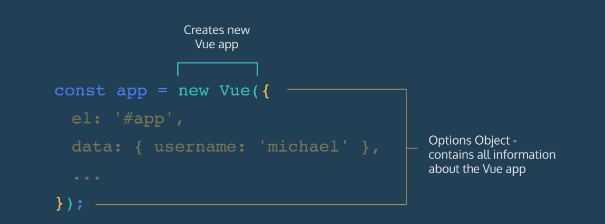

# `Vue.js Documentation by Gabriel Aigner`

## How to start?

You can import Vue by adding a ``<script>`` tag inside the ``<head>`` of your project’s HTML file:

```javascript
<script src="https://cdn.jsdelivr.net/npm/vue/dist/vue.js" defer></script>
```
We use the ``defer`` attribute on the ``<script>`` tag to make sure that the page is loaded and ready to hook up to Vue before we actually load Vue. \
\
Even at this preliminary step, the Vue team has found ways to shorten your development time. Many front-end frameworks, like React and Angular, have difficult setup processes that can make starting a project a hassle. The Vue team recognized that many complex front-end features aren’t useful until late in the front-end learning journey (or sometimes at all). As a result, they offered this simple alternative that provides most of Vue’s features to developers quickly and easily. \
\
Now you are ready to use `Vue.js`!

## Vue Modes

This section is only relevant if you are using a custom build setup. \
The Vue Modes can be sometimes nessesary for you if you use `VUE-CLI`. \

### Development Mode

If you are running Vue in an development environment

```
npm run dev
```

then you might see this warning:

```
You are running Vue in development mode.
Make sure to turn on production mode when deploying for production.
```

`Don’t be alarmed` it’s just to tell you, to use `minified version of vue.js` code when you have finished your development and ready to deploy the files on a web sever. Then it will be the `Production Mode`.

#### Find here more about [turning on Production Mode](https://vuejs.org/v2/guide/deployment.html)!

### Production Mode

```
npm run build
```

will create a distributable files (production ready) for you in folder dist (default) if you are using `vue-cli`.

## ``Creating Vue Apps``
Vue makes it easy to make a new app by exporting a class called ``Vue``. Much like any other JavaScript class, we create instances of this class using the ``new`` keyword. Each of these ``Vue`` instances is a fully-functioning Vue app. \
\
Let’s look at an example:
````javascript
// app.js
const app = new Vue({});
````
\
The Vue constructor takes in only one object, called the ``options object``. \
Each piece of information the Vue app needs to function is added to the options object as a key-value pair. \
This means that developers can easily update or add information in the Vue app by just looking for the correct key in the options object. \
\

\


## `Store the Data of html in js`

You can put all the data which would be in the html normally in the javascript.

As example: (normal version)

```javascript
<body>

        <div id="app">
            <p>Hello World!</p>
        </div>

        <script>
        "use strict"    // important

        var app = new Vue({
            el: "#app",
            data: {
                message: "hello, world!"
            }
        })
		</script>
	</body>
```
* ``"use strict"`` is important to use! [Click here](https://github.com/Kadukashi/Gabriels-JS-Documentation#what-is-%22%22?) to learn more.

There is something named the ``double mustache syntax``:  `{{ ... }}` the word you write into it has to be down in the ``vue``.
```javascript
<body>

        <div id="app">
            <p>{{ message }}</p>
        </div>

	<script>
        "use strict"

        var app = new Vue({
            el: "#app",
            data: {
                message: "hello, world!"
            }
        })

	</script>
</body>
```
This is an alternative syntax with the same functionality:
```javascript
<body>

        <div id="app">
            <p v-html="message"></p>
        </div>

	<script>
        "use strict"

        var app = new Vue({
            el: "#app",
            data: {
                message: "hello, world!"
            }
        })

	</script>
</body>
```

#### An example with input binding
In this example we ``bind`` the ``user input`` to ``message2``, and write that to the text field.

````javascript
<body>

        <div id="app">
            <input type="text" v-model="message2"></input>  // here we bind the user 
            <p                                              // input to message2
                v-html="
                    message1.slice(0, 7) +
                    message2
            "></p>
        </div>

        <script>
        "use strict"

        var app = new Vue({
            el: "#app",
            data: {
                message1: "Hello, World! ",
                message2: "Vue"
            }
        })

        </script>
</body>
````